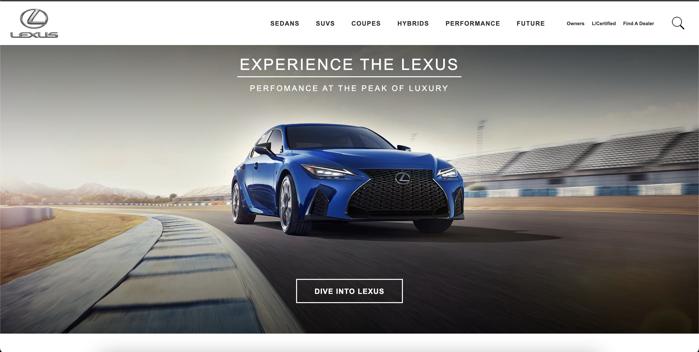
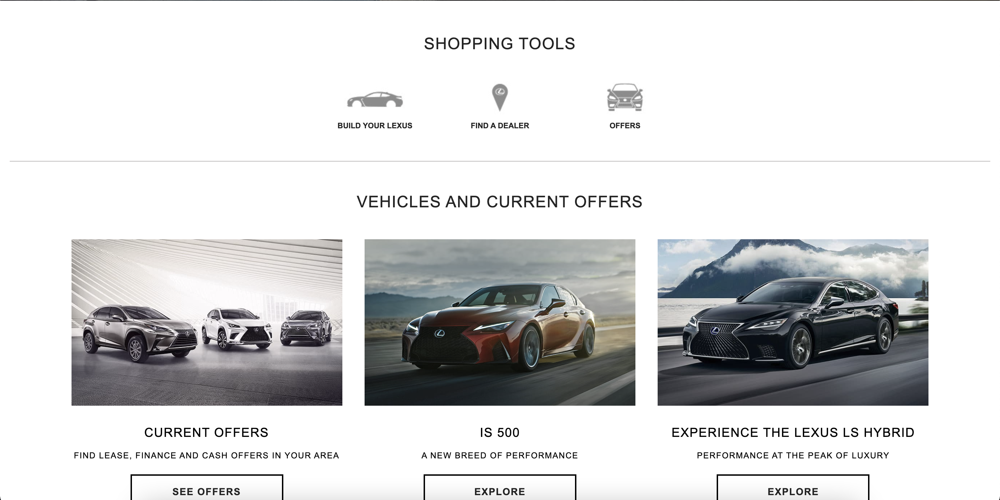
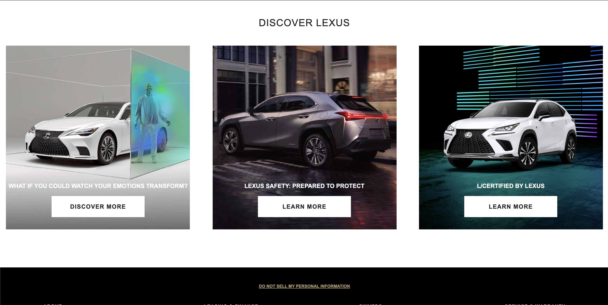
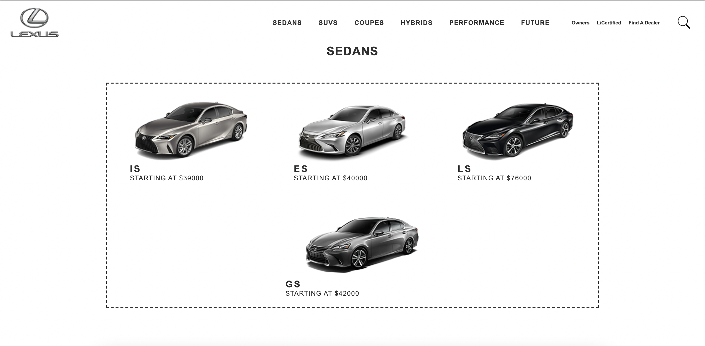
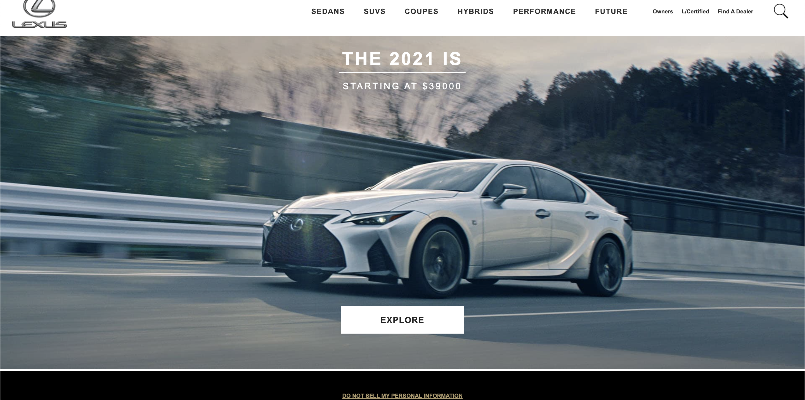
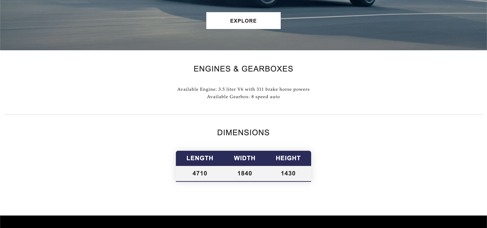
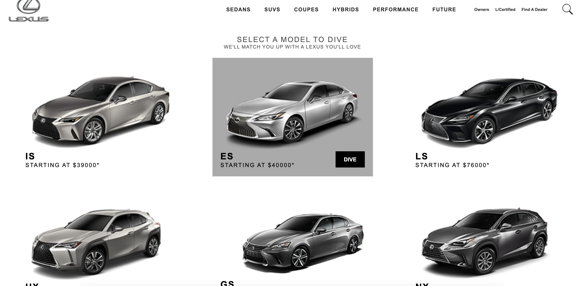

# Final Project For The Web Development Course

During this course, we learned the basics of HTML and CSS, JavaScript/TypeScript and in particular, we studied frameworks such as Angular and Django for frontend and backend development, respectively. The course was concluded by a rather big group project, where we tried to implement the website of a large car manufacturer, Lexus.
***

### Features
* Angular frontend framework and Django backend framework
* Full layout main page
* List of cars depending on a car body type
* A page containing information about the specific car
* Ability to create and add your own car
* SQLite database
* JWT authentication
* Many other pages
***

### Showcase

***

***

***

***

***

***

***

#### Images and sources belong to Lexus Corporation